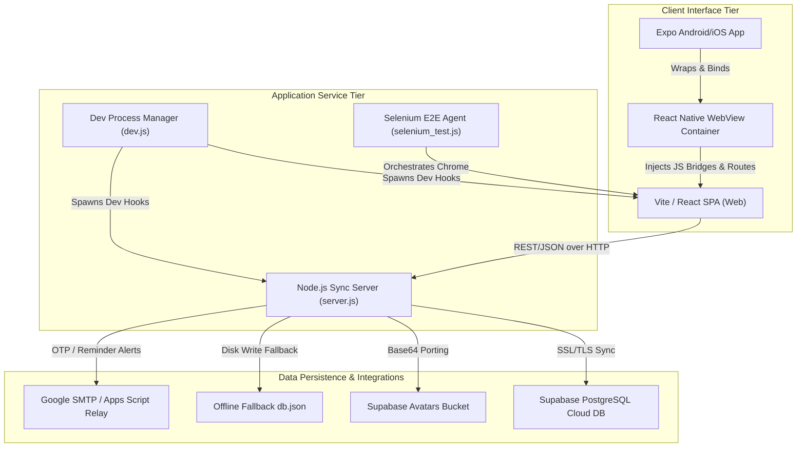

# 🧬 LifeMatrix AI — Enterprise-Grade Digital Healthcare Ecosystem

<div align="center">

  

  <br>
  [](#)
  [](#)
  [](#)
  [](#)
  [](#)
  [](#)
  [](#)
  [](#)

  <br><br>

  [](https://life-matrix-ai.vercel.app/)
  &nbsp;&nbsp;
  [](https://github.com/sathishr-ai/LifeMatrix-AI/raw/main/LifeMatrix-AI.apk)

</div>

---

## 🌌 1. Project Vision & Aesthetics

**LifeMatrix AI** is an advanced, premium-tier digital healthcare application that provides a unified, cross-platform health tracking, diagnostic, and risk analytics experience. Built on a zero-trust model design, the application provides medical dashboard tracking, smart medication scheduling, AI-powered symptom analysis, and local-to-cloud data synchronization.

### 🎨 The "Cyber-Cyan" Visual Identity
*   **Holographic Space:** The UI implements deep space tones (`#0B1528` and `#0A1F44`) matched with bright, bioluminescent colors such as cyan (`#00C6A7`), emerald, and indigo.
*   **Performance-Tuned Noise Overlay:** Subtle grid textures and background noise filter layers minimize eye strain while conveying a clinical, high-tech interface.
*   **Glassmorphism & Backdrop Blurs:** All dashboard cards feature high-performance translucent container panels with subtle border highlights to draw focus to critical health metrics.
*   **Fluid Motion Paths:** Transitions are managed by Framer Motion (`motion/react`), introducing spring physics, interactive micro-animations, and pulsating indicator states.

---

## 🏗️ 2. Architectural Blueprint

The platform connects three environments: a React/TS web application, a Node.js API server, and an Expo mobile wrapper.



---

## 🚀 3. Core Capabilities & Feature Modules

### 🏥 Digital Health Twin Modeler
Provides a comprehensive overview of user wellness metrics:
*   **Biometric Profiling:** Tracks biological parameters, lifestyle metrics (exercise intensity, water intake, sleep patterns), and medical history.
*   **Longitudinal Synthesis:** Compiles logs to map current vital stats into a digital projection model of the user.

### 🧠 Intelligent AI Symptom Engine
Provides an interactive symptom assessment workflow:
*   **Multi-Step Input:** Captures primary complaints, onset duration, and secondary symptoms.
*   **Severity Selector:** Uses interactive slider inputs to rate symptoms from minor discomfort to critical events.
*   **Clinical Analysis Screen:** Runs simulated neural network sweeps to gauge instability factors and display targeted diagnoses with recovery indicators.

### 📈 Risk Predictor & Analytics
*   **Recharts Integration:** Visualizes health trends over time, rendering real-time biological stability scores and historical curves.
*   **Predictive Calculations:** Uses lifestyle data inputs to calculate cardiovascular and systemic risk scores.

### ⏰ Medication Manager & Alarms
*   **Scheduling:** Set dosage metrics, timings, food associations, and custom alarms.
*   **Universal SMTP Delivery:** Dispatches automated email alarms directly to the patient's inbox using Google secure relay protocols.

### 🗺️ Healthcare Facility Navigator
*   **Clinic Mapping:** Finds nearby hospitals and clinics, displaying location data and facility contact details.

---

## 💻 4. REST API Endpoint Layout

The Node.js server (`server.js`) handles all user operations and data synchronization.

*   `GET /api/users` — Returns list of all registered users (Cloud/Fallback).
*   `POST /api/users` — Bulk syncs or signs up new users into system databases.
*   `GET /api/userdata` — Fetches active health profiles, medical history, and twins.
*   `POST /api/userdata` — Updates specific metrics. Automatically uploads Base64 images to Supabase storage.
*   `POST /api/userdata/remove` — Removes target attributes. Wipes uploaded files from Supabase bucket storage.
*   `POST /api/users/delete` — Triggers a cascading wipe of all data tables.
*   `GET /api/reminders` — Fetches all active medication reminder alarms.
*   `POST /api/reminders` — Configures and schedules a new medication alarm.
*   `DELETE /api/reminders` — Deletes a scheduled medication alarm.
*   `POST /api/auth/send-recovery-email` — Sends password recovery verification codes.

---

## 💾 5. Database Schema & Fallback System

### Supabase Cloud Structure
When Supabase keys are configured, the API connects to two target tables inside your cloud PostgreSQL instance:
*   **Users Security Table (`users`):** Stores essential authentication records such as names, unique email keys, salted passwords, and registration timestamps.
*   **User Data Profiles Table (`userdata`):** Implements a highly scalable key-value metadata store linked back to users via cascading foreign key constraints.

### Local JSON Failsafe File (`db.json`)
If Supabase is offline or unconfigured, the application falls back to local disk storage. This file structures credentials and profiles under distinct keys matching user accounts.

---

## 📱 6. React Native WebView Integration Bridge
The mobile application in the `/expo-app` directory serves as an optimized native wrapper for the web frontend. It uses **Expo WebView** to render the web client on target devices, enabling features like Javascript support, DOM storage caching, back-and-forth gestures, and native system bar styling matching the premium palette.

---

## 🔒 7. Vulnerability Audit & Remediation Guide

The security code review identified several issues. Below is a remediation plan to secure your deployment:

### 🚨 Critical Vulnerability 1: Plaintext Credentials Exposed
*   **Risk:** Supplying raw Supabase keys, Gmail accounts, and Google App passwords in the repository.
*   **Remediation:** Remove hardcoded constants from code and load them from environment variables via a configuration runner.

### 🚨 Critical Vulnerability 2: Plaintext Password Storage
*   **Risk:** Storing user credentials as plaintext on disk or in the cloud.
*   **Remediation:** Use password hashing libraries to salt and hash passwords during signup and verify them during login.

### 🚨 High Vulnerability 3: Broken Access Control (IDOR)
*   **Risk:** Any client can request data for any user by altering the query parameters.
*   **Remediation:** Implement secure session validation or token headers on all backend requests to restrict data access to authenticated users only.

### 🚨 High Vulnerability 4: Denial of Service via Large Payloads
*   **Risk:** The server reads incoming stream chunks indefinitely, allowing memory exhaust attacks.
*   **Remediation:** Enforce a maximum payload limit (e.g., `2MB`) on incoming requests and terminate connections that exceed this threshold.

---

## ⚡ 8. Installation & Setup Guide

### 📂 Step 1: Install Dependencies
Run this command in the project root to install all required dependencies:
```bash
npm install
```

To configure the mobile app dependencies, navigate to `/expo-app` and install:
```bash
cd expo-app
npm install
```

### 🌍 Step 2: Configure Environment Variables
Create a `.env` file in the root workspace folder with placeholder variables:
```env
PORT=5175
SUPABASE_URL=your_supabase_url_here
SUPABASE_ANON_KEY=your_supabase_key_here
GMAIL_USER=your_email_here@gmail.com
GMAIL_APP_PASSWORD=your_google_app_password_here
GOOGLE_APPS_SCRIPT_URL=your_google_script_url_here
```

### 💻 Step 3: Run the Development Server
Execute the synchronized dev loader script:
```bash
npm run dev
```
This spawns:
1.  **Vite Web App:** Listening on `http://localhost:5173/`
2.  **Node.js Backend Sync Server:** Listening on `http://localhost:5175/`

### 📱 Step 4: Run the Expo Mobile App
1.  Open a second terminal window.
2.  Navigate to `expo-app`:
    ```bash
    cd expo-app
    ```
3.  Start the Expo developer client:
    ```bash
    npx expo start
    ```
4.  Scan the terminal QR code using your physical device or launch an emulator (iOS/Android) to test the app wrapper.

### 🧪 Step 5: Execute End-to-End Tests
Verify the installation by running the Selenium E2E test suite:
```bash
node selenium_test.js
```
The test runner launches a Chrome instance, performs UI validation checks, and saves a summary report.

---

## 📜 9. Attributions & Licenses
*   **UI Components:** Styled using Tailwind CSS v4 and built on [shadcn/ui](https://ui.shadcn.com/) templates.
*   **Media Assets:** Graphic elements, illustration styles, and placeholder portraits sourced from [Unsplash](https://unsplash.com/).
*   **License:** Distributed under the MIT License.