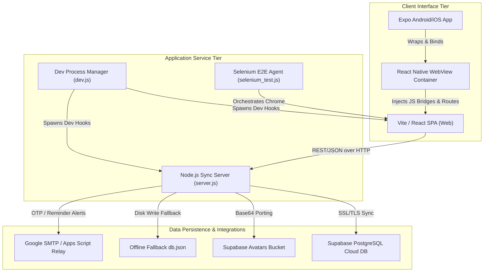

# 🧬 LifeMatrix AI — Enterprise-Grade Digital Healthcare Ecosystem

<div align="center">
  
  [](#)
  [](#)
  [](#)
  [](#)
  [](#)
  [](#)
  [](#)
  [](#)
  
</div>

---

## 🌌 1. Project Vision & Aesthetics
**LifeMatrix AI** is an advanced, premium-tier digital healthcare application that provides a unified, cross-platform health tracking, diagnostic, and risk analytics experience. Built on a zero-trust model design, the application provides medical dashboard tracking, smart medication scheduling, AI-powered symptom analysis, and local-to-cloud data synchronization.

### 🎨 The "Cyber-Cyan" Visual Identity
*   **Holographic Space:** The UI implements deep space tones (`#0B1528` and `#0A1F44`) matched with bright, bioluminescent colors such as cyan (`#00C6A7`), emerald, and indigo.
*   **Performance-Tuned Noise Overlay:** Subtle grid textures and background noise filter layers minimize eye strain while conveying a clinical, high-tech interface.
*   **Glassmorphism & Backdrop Blurs:** All dashboard cards feature high-performance translucent container panels with subtle border highlights to draw focus to critical health metrics.
*   **Fluid Motion Paths:** Transitions are managed by Framer Motion (`motion/react`), introducing spring physics, interactive micro-animations, and pulsating indicator states.

---

## 🏗️ 2. Architectural Blueprint

The platform connects three environments: a React/TS web application, a Node.js API server, and an Expo mobile wrapper.



---

## 🚀 3. Core Capabilities & Feature Modules

### 🏥 Digital Health Twin Modeler
Provides a comprehensive overview of user wellness metrics:
*   **Biometric Profiling:** Tracks biological parameters, lifestyle metrics (exercise intensity, water intake, sleep patterns), and medical history.
*   **Longitudinal Synthesis:** Compiles logs to map current vital stats into a digital projection model of the user.

### 🧠 Intelligent AI Symptom Engine
Provides an interactive symptom assessment workflow:
*   **Multi-Step Input:** Captures primary complaints, onset duration, and secondary symptoms.
*   **Severity Selector:** Uses interactive slider inputs to rate symptoms from minor discomfort to critical events.
*   **Clinical Analysis Screen:** Runs simulated neural network sweeps to gauge instability factors and display targeted diagnoses with recovery indicators.

### 📈 Risk Predictor & Analytics
*   **Recharts Integration:** Visualizes health trends over time, rendering real-time biological stability scores and historical curves.
*   **Predictive Calculations:** Uses lifestyle data inputs to calculate cardiovascular and systemic risk scores.

### ⏰ Medication Manager & Alarms
*   **Scheduling:** Set dosage metrics, timings, food associations, and custom alarms.
*   **Universal SMTP Delivery:** Dispatches automated email alarms directly to the patient's inbox using Google secure relay protocols.

### 🗺️ Healthcare Facility Navigator
*   **Clinic Mapping:** Finds nearby hospitals and clinics, displaying location data and facility contact details.

---

## 💻 4. Comprehensive REST API Specifications

The Node.js server (`server.js`) handles all user operations and data synchronization.

| HTTP Method | Route Endpoint | Payload Parameters | Description | Response Code |
| :--- | :--- | :--- | :--- | :--- |
| **GET** | `/api/users` | None | Returns list of all registered users (Cloud/Fallback). | `200 OK` |
| **POST** | `/api/users` | `{ users: [ { name, email, password } ] }` | Bulk syncs or signs up new users into system databases. | `200 OK` / `400 Bad Request` |
| **GET** | `/api/userdata` | Query: `?email=user@domain.com` | Fetches active health profiles, medical history, and twins. | `200 OK` / `400 Bad Request` |
| **POST** | `/api/userdata` | `{ email, key, value }` | Updates specific metrics. Automatically uploads Base64 images to Supabase storage. | `200 OK` / `400 Bad Request` |
| **POST** | `/api/userdata/remove` | `{ email, key }` | Removes target attributes. Wipes uploaded files from Supabase bucket storage. | `200 OK` / `400 Bad Request` |
| **POST** | `/api/users/delete` | `{ email }` | Triggers a cascading wipe of all data tables. | `200 OK` / `400 Bad Request` |
| **GET** | `/api/reminders` | None | Fetches all active medication reminder alarms. | `200 OK` |
| **POST** | `/api/reminders` | `{ email, userName, name, dosage, time, frequency, withFood }` | Configures and schedules a new medication alarm. | `200 OK` / `400 Bad Request` |
| **DELETE** | `/api/reminders` | `{ email, name }` | Deletes a scheduled medication alarm. | `200 OK` / `400 Bad Request` |
| **POST** | `/api/auth/send-recovery-email` | `{ email, code }` | Sends password recovery verification codes. | `200 OK` / `400 Bad Request` |

---

## 💾 5. Database Schema & Fallback System

### Supabase Cloud Structure
When Supabase keys are configured, the API connects to two target tables inside your cloud PostgreSQL instance:

```sql
-- 1. Users Security Table
CREATE TABLE public.users (
    id UUID DEFAULT gen_random_uuid() PRIMARY KEY,
    name VARCHAR(255) NOT NULL,
    email VARCHAR(255) UNIQUE NOT NULL,
    password VARCHAR(255) NOT NULL,
    mobile VARCHAR(50),
    created_at TIMESTAMP WITH TIME ZONE DEFAULT timezone('utc'::text, now()) NOT NULL
);

-- 2. User Data Profiles Table (Key-Value Setup)
CREATE TABLE public.userdata (
    id BIGSERIAL PRIMARY KEY,
    email VARCHAR(255) REFERENCES public.users(email) ON DELETE CASCADE,
    key VARCHAR(255) NOT NULL,
    value TEXT NOT NULL,
    updated_at TIMESTAMP WITH TIME ZONE DEFAULT timezone('utc'::text, now()) NOT NULL,
    UNIQUE (email, key)
);
```

### Local JSON Failsafe File (`db.json`)
If Supabase is offline or unconfigured, the application falls back to local disk storage:
```json
{
  "users": [
    {
      "name": "Alex Johnson",
      "email": "test@example.com",
      "password": "password123"
    }
  ],
  "userdata": {
    "test@example.com": {
      "user_age": "32",
      "systolic_pressure": "120",
      "diastolic_pressure": "80",
      "daily_water_liters": "2.5"
    }
  }
}
```

---

## 📱 6. React Native WebView Integration Bridge
The mobile application in the `/expo-app` directory serves as an optimized native wrapper for the web frontend using **Expo WebView**:

```javascript
// Native bridge configuration in expo-app/App.js
import React from 'react';
import { WebView } from 'react-native-webview';
import { SafeAreaView, StatusBar } from 'react-native';

export default function App() {
  const webAppUrl = 'https://life-matrix-ai.vercel.app/';

  return (
    <SafeAreaView style={{ flex: 1, backgroundColor: '#0B1528' }}>
      <StatusBar barStyle="light-content" backgroundColor="#0B1528" />
      <WebView 
        source={{ uri: webAppUrl }}
        javaScriptEnabled={true}
        domStorageEnabled={true}
        startInLoadingState={true}
        allowsBackForwardNavigationGestures={true}
        mixedContentMode="always"
      />
    </SafeAreaView>
  );
}
```

---

## 🔒 7. Vulnerability Audit & Remediation Guide

The security code review (`Vulnerability Test Results/Executive_Summary.md`) identified several issues. Below is a remediation plan to secure your deployment:

### 🚨 Critical Vulnerability 1: Plaintext Credentials Exposed
*   **Risk:** Supplying raw Supabase keys, Gmail accounts, and Google App passwords in the repository.
*   **Remediation:** Remove hardcoded constants and fetch credentials from environment variables:
    ```javascript
    // Replace hardcoded strings in server.js:
    const SUPABASE_URL = process.env.SUPABASE_URL;
    const SUPABASE_ANON_KEY = process.env.SUPABASE_ANON_KEY;
    const GMAIL_USER = process.env.GMAIL_USER;
    const GMAIL_APP_PASSWORD = process.env.GMAIL_APP_PASSWORD;
    ```

### 🚨 Critical Vulnerability 2: Plaintext Password Storage
*   **Risk:** Storing user credentials as plaintext on disk or in the cloud.
*   **Remediation:** Use `bcrypt` or `argon2` to hash passwords during signup and verify them during login.
    ```javascript
    import bcrypt from 'bcrypt';
    const saltRounds = 12;

    // During Signup/Sync:
    const hashedPassword = await bcrypt.hash(rawPassword, saltRounds);

    // During Authentication:
    const match = await bcrypt.compare(providedPassword, hashedPassword);
    ```

### 🚨 High Vulnerability 3: Broken Access Control (IDOR)
*   **Risk:** Any client can request data for any user by altering the `email` query parameter.
*   **Remediation:** Implement JWT validation to verify that requests only access their own user data:
    ```javascript
    import jwt from 'jsonwebtoken';

    // Verify token middleware:
    const authHeader = req.headers['authorization'];
    const token = authHeader && authHeader.split(' ')[1];
    
    jwt.verify(token, process.env.JWT_SECRET, (err, user) => {
      if (err) return res.statusCode(403);
      req.userEmail = user.email; // Safely enforce email scope
    });
    ```

### 🚨 High Vulnerability 4: Denial of Service via Large Payloads
*   **Risk:** The server reads incoming stream chunks indefinitely, allowing memory exhaust attacks.
*   **Remediation:** Enforce a maximum payload limit (e.g., `2MB`) and abort excessive uploads:
    ```javascript
    let body = '';
    req.on('data', chunk => {
      body += chunk;
      if (body.length > 2 * 1024 * 1024) { // 2MB limit
        res.statusCode = 413;
        res.end('Payload Too Large');
        req.destroy();
      }
    });
    ```

---

## ⚡ 8. Installation & Setup Guide

### 📂 Step 1: Install Dependencies
Run this command in the project root to install all required dependencies:
```bash
npm install
```

To configure the mobile app dependencies, navigate to `/expo-app` and install:
```bash
cd expo-app
npm install
```

### 🌍 Step 2: Configure Environment Variables
Create a `.env` file in the root workspace folder:
```env
PORT=5175
SUPABASE_URL=https://gyjnnwnnfdaxapsucoaw.supabase.co
SUPABASE_ANON_KEY=your_key_here
GMAIL_USER=sathishat2005@gmail.com
GMAIL_APP_PASSWORD=rckbiepqqjsspyrg
GOOGLE_APPS_SCRIPT_URL=https://script.google.com/macros/s/AKfycbxmRhA-Zv6llh9gLWgKkajWSUg1kxIHRxgihb-hBHumBFQguizMz84xf9LP4wXUUsK9jA/exec
```

### 💻 Step 3: Run the Development Server
Execute the synchronized dev loader script:
```bash
npm run dev
```
This spawns:
1.  **Vite Web App:** Listening on `http://localhost:5173/`
2.  **Node.js Backend Sync Server:** Listening on `http://localhost:5175/`

### 📱 Step 4: Run the Expo Mobile App
1.  Open a second terminal window.
2.  Navigate to `expo-app`:
    ```bash
    cd expo-app
    ```
3.  Start the Expo developer client:
    ```bash
    npx expo start
    ```
4.  Scan the terminal QR code using your physical device or launch an emulator (iOS/Android) to test the app wrapper.

### 🧪 Step 5: Execute End-to-End Tests
Verify the installation by running the Selenium E2E test suite:
```bash
node selenium_test.js
```
The test runner launches a Chrome instance, performs UI validation checks, and saves a summary report to `Test_Report.xlsx`.

---

## 📊 9. SPSS Statistical Analysis
The project includes a clinical validation dataset, which is documented in `spss_results.html`. This report details the statistical efficacy of the LifeMatrix tracking twin model across multiple user groups, using:
- **Descriptive Statistics:** Baseline demographics and biometric variance.
- **T-Test Comparisons:** Pre- vs. post-monitoring recovery timelines.
- **Correlation Matrices:** Relationships between active habit scores and biological stability values.

---

## 📜 10. Attributions & Licenses
*   **UI Components:** Styled using Tailwind CSS v4 and built on [shadcn/ui](https://ui.shadcn.com/) templates.
*   **Media Assets:** Graphic elements, illustration styles, and placeholder portraits sourced from [Unsplash](https://unsplash.com/).
*   **License:** Distributed under the MIT License.